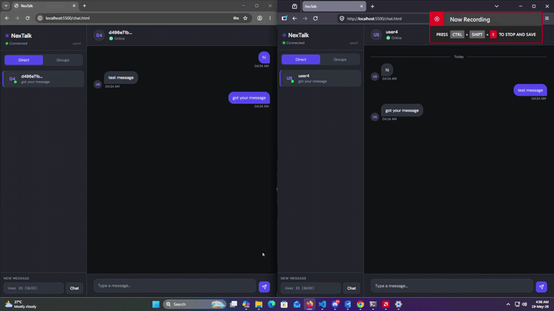
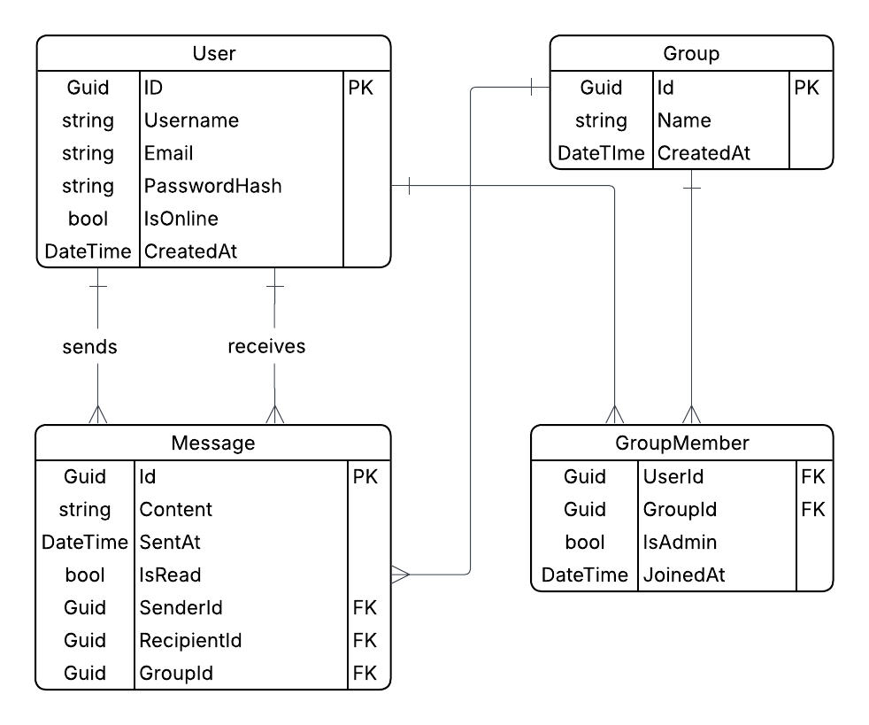

# NexTalk Backend API

A real-time chat backend built with **ASP.NET Core**, **SignalR**, and **Entity Framework Core**. Supports direct messaging, group chats, JWT authentication, and live presence tracking.

## Preview



## Entity Relationship Diagram



---

## Tech Stack

- **ASP.NET Core** — Web API framework
- **SignalR** — Real-time WebSocket communication
- **Entity Framework Core** — ORM with SQL Server
- **JWT Bearer** — Authentication & authorization

---

## Getting Started

### Prerequisites

- [.NET 8 SDK](https://dotnet.microsoft.com/download)
- SQL Server (local or remote)

### Setup

1. **Clone the repository**
   ```bash
   git clone https://github.com/mostafijur566/NexTalk.git
   cd NexTalk
   ```

2. **Configure `appsettings.json`**
   ```json
   {
     "ConnectionStrings": {
       "DefaultConnection": "Server=localhost;Database=NexTalkDb;Trusted_Connection=True;"
     },
     "JWT": {
       "Issuer": "your-issuer",
       "Audience": "your-audience",
       "SigningKey": "your-secret-key-min-32-chars"
     }
   }
   ```

3. **Apply database migrations**
   ```bash
   dotnet ef database update
   ```

4. **Run the backend**
   ```bash
   dotnet run --launch-profile http
   ```

   API will be available at `http://localhost:5096`

5. **Run the frontend**
   ```bash
   cd ..
   python -m http.server 5500
   ```

   Then open `http://localhost:5500/chat.html` in your browser.

---

## Project Structure

```
NexTalk/
├── chat.html                  # Frontend client (served separately)
└── app/
    ├── Controllers/
    │   ├── AuthController.cs
    │   ├── ChatController.cs
    │   └── GroupController.cs
    ├── Hubs/
    │   └── ChatHub.cs
    ├── Interface/
    │   ├── IAuthRepository.cs
    │   ├── IChatRepository.cs
    │   └── IGroupRepository.cs
    ├── Repository/
    │   ├── AuthRepository.cs
    │   ├── ChatRepository.cs
    │   └── GroupRepository.cs
    ├── Models/
    │   ├── User.cs
    │   ├── Message.cs
    │   ├── Group.cs
    │   └── GroupMember.cs
    ├── Dtos/
    │   ├── Auth/
    │   ├── Chat/
    │   └── Group/
    ├── Data/
    │   └── ApplicationDbContext.cs
    ├── Properties/
    │   └── launchSettings.json
    └── Program.cs
```

---

## Data Models

### User
| Field | Type | Description |
|-------|------|-------------|
| `Id` | `Guid` | Primary key |
| `Username` | `string` | Unique, max 50 chars |
| `Email` | `string` | Unique, max 100 chars |
| `PasswordHash` | `string` | Bcrypt hashed password |
| `IsOnline` | `bool` | Online status |
| `CreatedAt` | `DateTime` | UTC timestamp |

### Message
| Field | Type | Description |
|-------|------|-------------|
| `Id` | `Guid` | Primary key |
| `Content` | `string` | Max 2000 chars |
| `SentAt` | `DateTime` | UTC timestamp |
| `IsRead` | `bool` | Read receipt flag |
| `SenderId` | `Guid` | FK → User |
| `RecipientId` | `Guid?` | FK → User (null for group messages) |
| `GroupId` | `Guid?` | FK → Group (null for direct messages) |

### Group
| Field | Type | Description |
|-------|------|-------------|
| `Id` | `Guid` | Primary key |
| `Name` | `string` | Max 100 chars |
| `CreatedAt` | `DateTime` | UTC timestamp |

### GroupMember
| Field | Type | Description |
|-------|------|-------------|
| `UserId` | `Guid` | Composite PK, FK → User |
| `GroupId` | `Guid` | Composite PK, FK → Group |
| `IsAdmin` | `bool` | Admin flag |
| `JoinedAt` | `DateTime` | UTC timestamp |

---

## API Endpoints

### Auth — `/api/auth`

| Method | Endpoint | Description | Auth |
|--------|----------|-------------|------|
| POST | `/api/auth/register` | Register a new user | ❌ |
| POST | `/api/auth/login` | Login and receive JWT token | ❌ |

### Chat — `/api/chat`

| Method | Endpoint | Description | Auth |
|--------|----------|-------------|------|
| POST | `/api/chat/direct` | Send a direct message | ✅ |
| GET | `/api/chat/direct/{userId}` | Get direct message history | ✅ |
| POST | `/api/chat/group/{groupId}` | Send a group message | ✅ |
| GET | `/api/chat/group/{groupId}` | Get group message history | ✅ |
| GET | `/api/chat/conversations` | Get all conversations | ✅ |

### Groups — `/api/group`

| Method | Endpoint | Description | Auth |
|--------|----------|-------------|------|
| POST | `/api/group` | Create a new group | ✅ |
| GET | `/api/group` | Get groups I belong to | ✅ |
| GET | `/api/group/{id}/members` | List group members | ✅ |
| POST | `/api/group/{id}/members` | Add a member to group | ✅ |
| DELETE | `/api/group/{id}/members/{userId}` | Remove a member from group | ✅ |

---

## SignalR Hub

**URL:** `/hubs/chat`  
**Auth:** JWT Bearer token required

Connect from the frontend:
```javascript
const connection = new signalR.HubConnectionBuilder()
  .withUrl("http://localhost:5096/hubs/chat", {
    accessTokenFactory: () => yourJwtToken
  })
  .withAutomaticReconnect()
  .build();
```

### Client → Server (Methods to invoke)

| Method | Parameters | Description |
|--------|------------|-------------|
| `SendDirectMessage` | `{ recipientId, content }` | Send a direct message |
| `SendGroupMessage` | `groupId, { content }` | Send a message to a group |
| `JoinGroup` | `groupId` | Join a SignalR group room |
| `LeaveGroup` | `groupId` | Leave a SignalR group room |
| `TypingDirect` | `recipientId` | Notify recipient you are typing |
| `TypingGroup` | `groupId` | Notify group you are typing |
| `MarkAsRead` | `senderId` | Notify sender messages were read |

### Server → Client (Events to listen for)

| Event | Payload | Description |
|-------|---------|-------------|
| `UserOnline` | `userId` | A user connected |
| `UserOffline` | `userId` | A user disconnected |
| `OnlineUsers` | `userId[]` | List of online users (sent on connect) |
| `ReceiveDirectMessage` | message object | Incoming direct message |
| `ReceiveGroupMessage` | message object | Incoming group message |
| `UserJoinedGroup` | `{ userId, groupId }` | A user joined a group |
| `UserLeftGroup` | `{ userId, groupId }` | A user left a group |
| `UserTyping` | `userId` | Someone is typing in a DM |
| `UserTypingInGroup` | `{ userId, groupId }` | Someone is typing in a group |
| `MessageRead` | `userId` | Your message was read |

---

## Authentication

All protected endpoints and the SignalR hub require a **JWT Bearer token** obtained from `/api/auth/login`.

Include it in every request header:
```
Authorization: Bearer <your-token>
```

---

## Development Notes

- `UseHttpsRedirection` is disabled for local development. Re-enable it for production.
- CORS is configured for `http://localhost:5500`. Update `Program.cs` before deploying.
- Online presence is tracked in-memory (`Dictionary<string, string>`). It resets on server restart and won't work across multiple server instances — use Redis for production.
- Message content is capped at **2000 characters** by the database schema.
